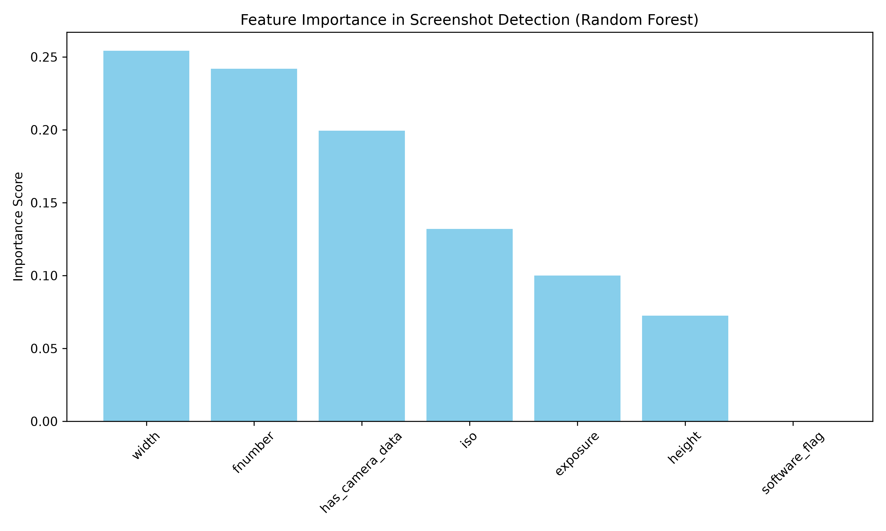
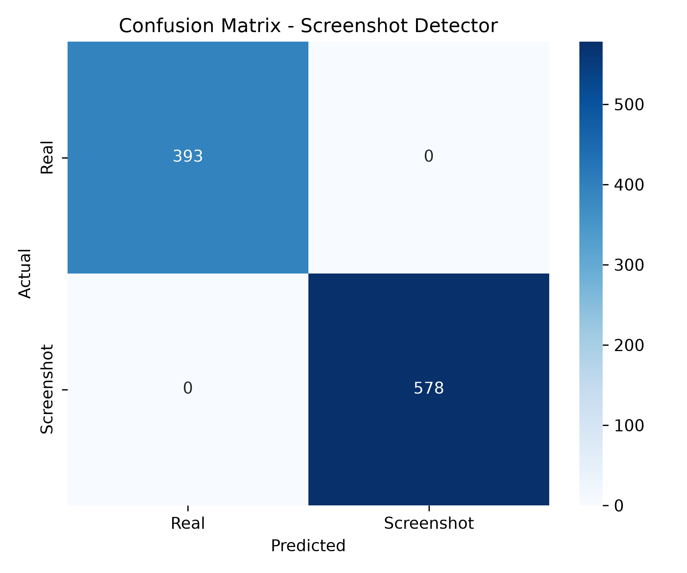
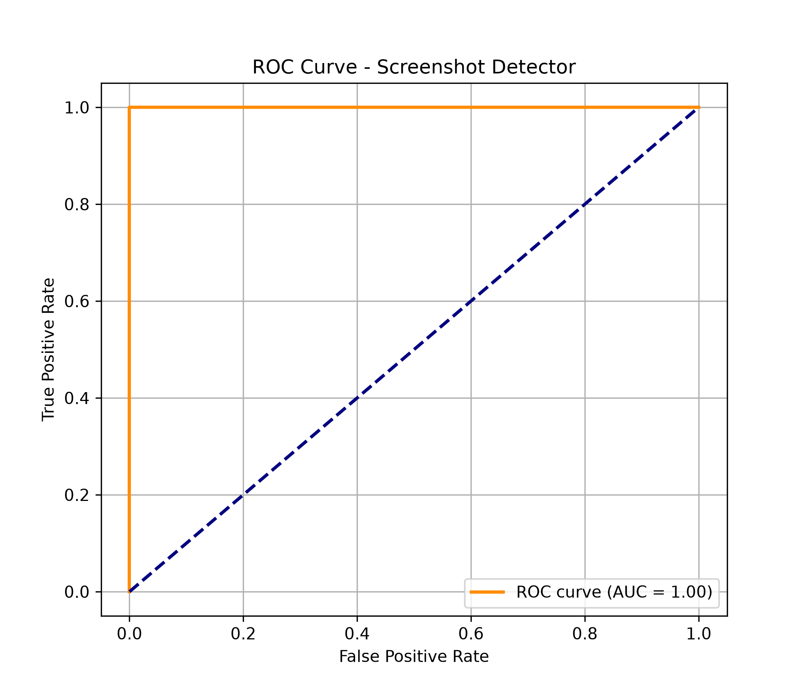
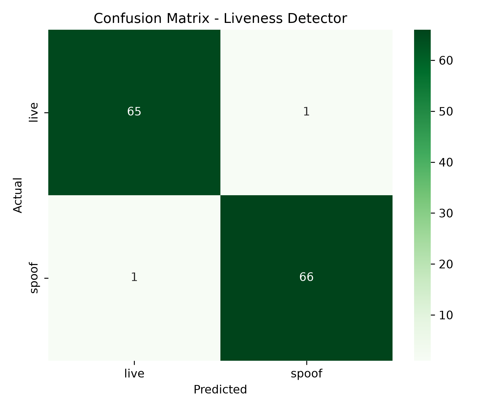
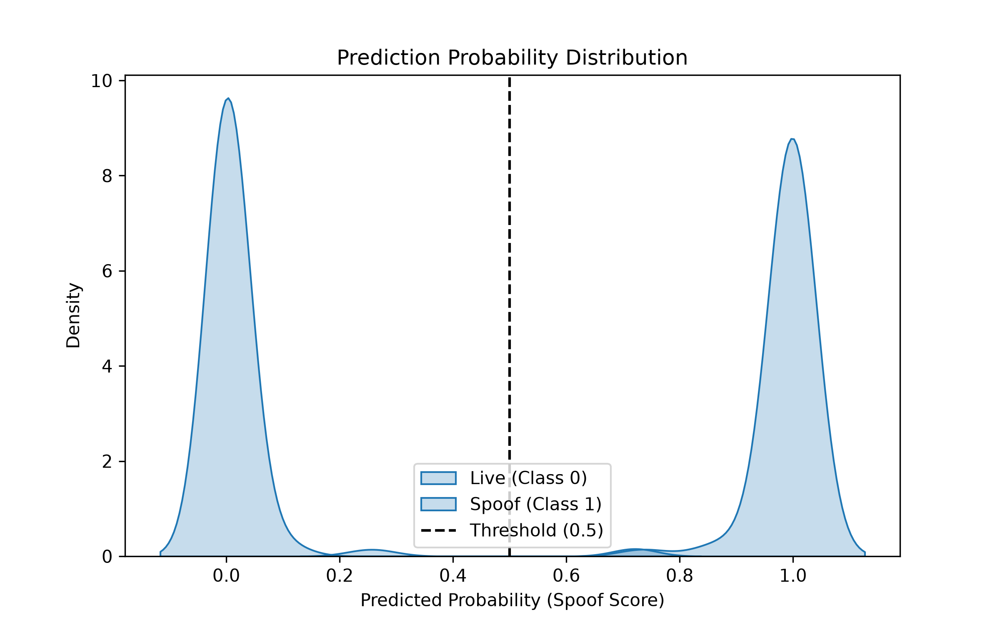
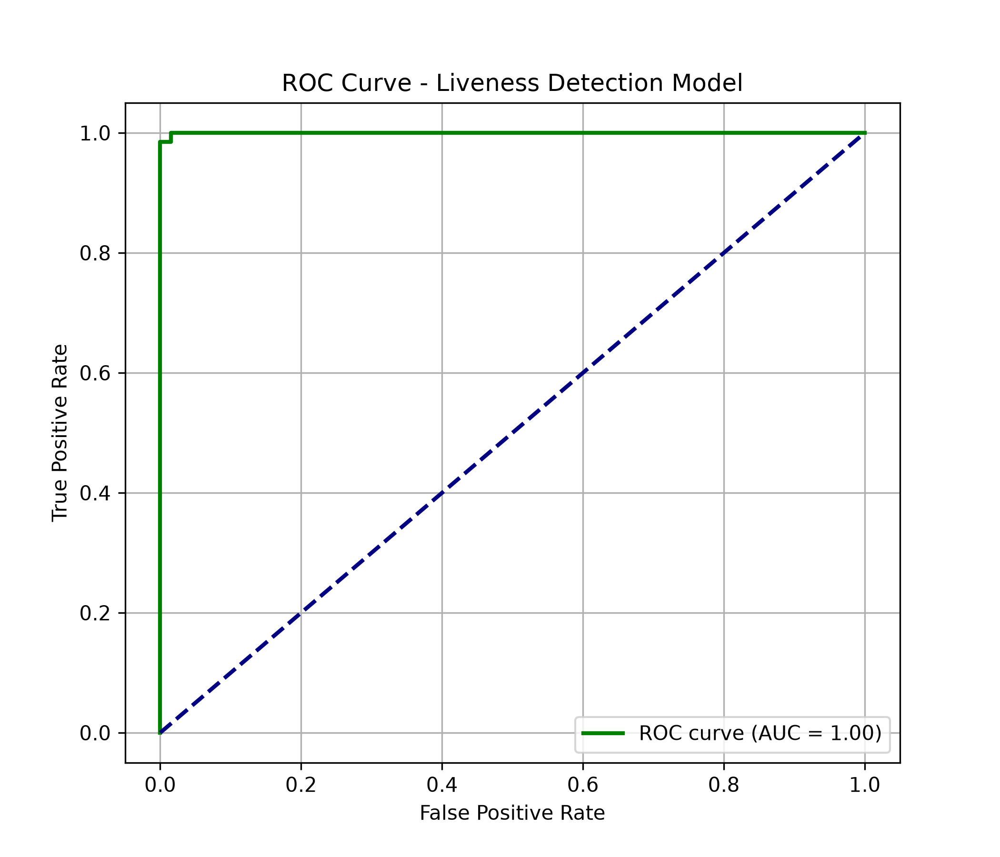
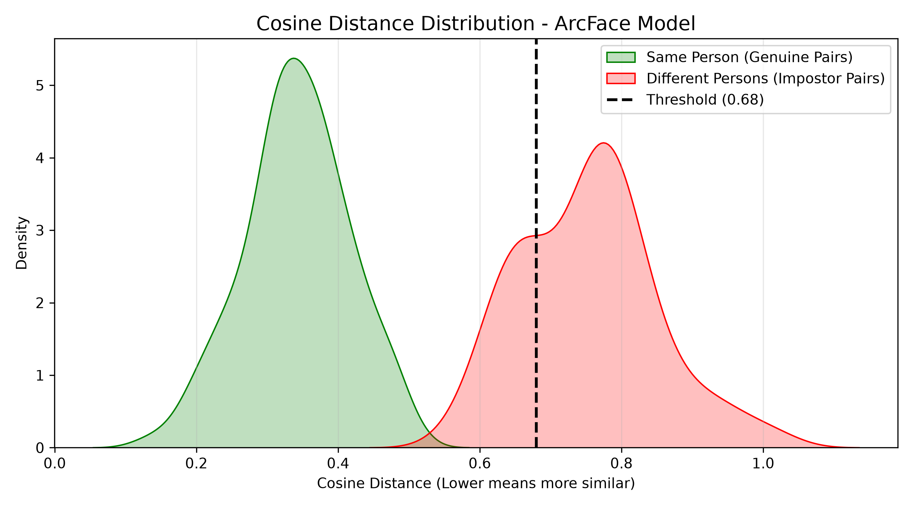

# Vision: Intelligent Multi-Tier KYC & Face Verification Pipeline


**Vision** is an end-to-end Machine Learning and Computer Vision Know Your Customer (KYC) security pipeline. It enforces a 3-tier verification pipeline designed to detect fraudulent submissions (screenshots, screen recapture spoofs, and biometric identity mismatches) before approving digital onboarding requests.

---

## 🌟 Key Features & Architecture

The system uses a **Fail-Fast Pipeline Architecture**: computationally inexpensive metadata checks run first, followed by deep learning liveness models, and finally high-dimensional biometric face matching.

```
                    [ User Input Images ]
                              │
                              ▼
                 ┌────────────────────────┐
                 │   Screenshot Detector  │ ──(Screenshot)──► [ REJECT ]
                 │    (Random Forest)     │
                 └────────────┬───────────┘
                              │ (Real Photo)
                              ▼
                 ┌────────────────────────┐
                 │   Liveness Detector    │ ──(Spoof/Recapture)─► [ REJECT ]
                 │      (Custom CNN)      │
                 └────────────┬───────────┘
                              │ (Live Capture)
                              ▼
                 ┌────────────────────────┐
                 │   Face Verification    │ ──(Mismatch)───────► [ REJECT ]
                 │   (ArcFace + Retina)   │
                 └────────────┬───────────┘
                              │ (Verified Match)
                              ▼
                       [ KYC PASSED ]
```

### 1. Screenshot Detector (Tier 1)
* **Technology**: EXIF Metadata Extraction + Random Forest Classifier (`metadata_model.pkl`).
* **Function**: Inspects hardware lens parameters (`FNumber`, `ExposureTime`, `ISO`, image dimensions) to detect OS-generated screenshots versus real camera captures.

### 2. Recapture / Liveness Detector (Tier 2)
* **Technology**: Custom 4-Layer Convolutional Neural Network (`liveness_model.h5`) implemented in TensorFlow/Keras.
* **Function**: Analyzes micro-textures, Moiré patterns, and screen reflections to differentiate live camera feeds from recaptured photos (spoofs displayed on monitors or printed paper).

### 3. Biometric Face Verification (Tier 3)
* **Technology**: DeepFace framework using **ArcFace** embeddings ($512$-D) with **RetinaFace** detection backend.
* **Function**: Detects faces, aligns landmarks, and calculates Cosine Distance between user selfies and ID document photos using a default threshold of $0.68$.

---

## 📁 Repository Structure

```
.
├── assets/                       # Performance evaluation charts and visualizations
│   ├── CNN.jpg
│   ├── face_verification_distance_dist.png
│   ├── liveness_cm.png
│   ├── liveness_prob_dist.png
│   ├── liveness_roc.png
│   ├── screenshot_cm.png
│   ├── screenshot_feature_importance.png
│   └── screenshot_roc.png
├── docs/                         # Detailed academic report (PDF & DOCX)
│   ├── RV-report.docx
│   └── RV-report.pdf
├── src/                          # Project source code
│   ├── Face_recognision/
│   │   ├── face_recognition_v2.py
│   │   ├── face_recognition_v3.py
│   │   └── plots.py
│   ├── recapture_detector/
│   │   ├── liveness_model.h5
│   │   ├── plots.py
│   │   └── recapture_detector.py
│   └── screenshot_detector/
│       ├── metadata_model.pkl
│       ├── plots.py
│       ├── plots2.py
│       └── screenshot_detector.py
├── pyproject.toml                # Project metadata and dependencies
├── uv.lock                       # Lockfile for reproducible environment setup
└── README.md
```

---

## 📊 Performance & Evaluation Results

### Tier 1: Screenshot Detection Results
* **Accuracy**: 100% on metadata validation set.
* **Key Indicators**: `width`, `fnumber`, and camera EXIF presence dominate feature importance.

| Feature Importance | Confusion Matrix | ROC Curve (AUC = 1.00) |
| :---: | :---: | :---: |
|  |  |  |

---

### Tier 2: Recapture / Liveness Detection Results
* **Accuracy**: 98.50% (131/133 samples correctly classified).
* **AUC**: 0.998 (~1.00).

| Confusion Matrix | Prediction Distribution | ROC Curve |
| :---: | :---: | :---: |
|  |  |  |

---

### Tier 3: ArcFace Face Verification Results
* **Optimal Cosine Distance Threshold**: `0.68`
* Clear separation between Genuine pairs (same identity) and Impostor pairs (different identity).

| Distance Distribution Curve |
| :---: |
|  |

---

## 🚀 Installation & Setup

### Prerequisites
* Python `>= 3.12`
* Recommended: [`uv`](https://github.com/astral-sh/uv) (fast Python package installer) or `pip`

### 1. Clone the Repository
```bash
git clone https://github.com/your-username/vision.git
cd vision
```

### 2. Set Up Virtual Environment

#### Using `uv` (Recommended):
```bash
uv venv
source .venv/bin/activate  # On Windows: .venv\Scripts\activate
uv sync
```

#### Using standard `pip`:
```bash
python -m venv .venv
source .venv/bin/activate  # On Windows: .venv\Scripts\activate
pip install -e .
```

---

## 🛠️ How to Run

### 1. Run Screenshot Detector
Launch the Tkinter GUI to load an image and evaluate metadata:
```bash
python src/screenshot_detector/screenshot_detector.py
```
*(Optional: Train the Random Forest model)*
```bash
python src/screenshot_detector/screenshot_detector.py --train
```

### 2. Run Liveness / Recapture Detector
Launch the interactive Liveness Detector application:
```bash
python src/recapture_detector/recapture_detector.py
```
*(Optional: Train the CNN model)*
```bash
python src/recapture_detector/recapture_detector.py --train
```

### 3. Run Face Recognition & Verification
Compare a selfie photo against an ID photo using ArcFace and RetinaFace:
```bash
python src/Face_recognision/face_recognition_v2.py
```

### 4. Generate Performance Plots
To regenerate evaluation metrics and plots without retraining:
```bash
python src/screenshot_detector/plots.py
python src/recapture_detector/plots.py
python src/Face_recognision/plots.py
```

---

## 📄 Documentation

For an in-depth technical report covering theoretical background, CNN layer specifications, loss function formulations (ArcFace Additive Angular Margin, Binary Cross-Entropy), and threat analysis, refer to the documents in the `docs/` folder:
* **PDF Report**: `docs/RV-report.pdf`
* **Word Report**: `docs/RV-report.docx`

---

## 📜 License

This project is licensed under the [MIT License](LICENSE).
